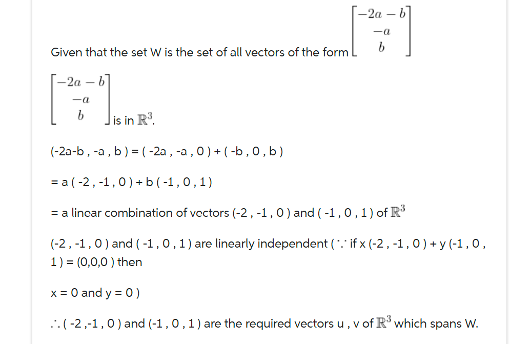

# FINAL REVIEW 
NOTE: PLEASE DOWNLOAD THE `README.md` file and open it in any markdown editor if it gives you any problems viewing the equations
## Index
- [FINAL REVIEW](#final-review)
  - [Index](#index)
  - [Topics](#topics)
    - [1. Solution of systems of equations / Linear dependence and indepence](#1-solution-of-systems-of-equations--linear-dependence-and-indepence)
    - [2. Row echelon form and reduced echelon form](#2-row-echelon-form-and-reduced-echelon-form)
    - [3. Matrix operations and transformations](#3-matrix-operations-and-transformations)
    - [4. Linear combination of vectors](#4-linear-combination-of-vectors)
    - [5. Inverse](#5-inverse)
    - [6. Vectors](#6-vectors)
      - [6.1 Vector between 2 points](#61-vector-between-2-points)
      - [6.2 Dot product](#62-dot-product)
      - [6.3 Cosine between vectors](#63-cosine-between-vectors)
      - [6.4 Unit vector in different directions / Vector normalization / Magnitude](#64-unit-vector-in-different-directions--vector-normalization--magnitude)
      - [6.5 Subspace](#65-subspace)
      - [6.6 Orthogonal projection](#66-orthogonal-projection)
      - [6.7 Cross product](#67-cross-product)
      - [6.8 Span](#68-span)

## Topics
### 1. Solution of systems of equations / Linear dependence and indepence
- PROBLEMS: 1 - 13, 18 - 25, 32 - 34, 58 - 59
- You can use substitution, elimination, and augmented matrix row reduction.
- In any case, the system may end up having infinite many solutions. For that, in matrix row reduction, at least one row will be all zero. If a row ends up being 
  $$\begin{bmatrix}\text{ } 0 & 0 & 0 & \bigm| & \text{number other than 0 } \end{bmatrix}$$
  , then there is no solution.
- To know if the system has infinite many solutions, the number columns (n), has to be greater than the number of rows (m). This also applies to 
   [Back to Index](#index)

### 2. Row echelon form and reduced echelon form
- Problems: 14 - 17
- Echelon form: Has pivot ones in diagonal and zeroes below it 
  $\begin{bmatrix} 1 & 4 & 1 \\ 0 & 1 & 1 \\ 0 & 0 & 1 \end{bmatrix}$
- Reduced echelon form: Has pivot numbers in diagonal and zeroes below it and above it 
$\begin{bmatrix}1 & 0 & 0 \\ 0 & 1 & 0 \\ 0 & 0 & 1\end{bmatrix}$
- Non-echelon form: Does not have pivot's diagonally. Doesn't have staircase 0's structure. It also applies if a row entirely comprised of 0's is in any of the beginning or middle positions    $\begin{bmatrix}1 & 0 & 4 \\ 4 & 7 & 8 \\ 0 & 0 & 0\end{bmatrix}$
   [Back to Index](#index)

### 3. Matrix operations and transformations
- Problems: 26-31, 38-49, 54-55, 
- Addition: To perform addition, matrices must have the exact same dimmensions  
$\begin{bmatrix} 5 &  7 \\ 5 & 8 \end{bmatrix} + \begin{bmatrix} 1 & 0 \\ 0 & 1 \end{bmatrix} = \begin{bmatrix} 6 & 7 \\ 5 & 9 \end{bmatrix}$
- Scalar multiplication: When a vector is multiplied by a scalar, we just distribute the scalar to each of the values of the vectors
$$2 \cdot \begin{bmatrix} 8 & 4 \\ 5 & 2 \end{bmatrix} = \begin{bmatrix} 16 & 8 \\ 10 & 4 \end{bmatrix}$$
- Transpose. Denoted as $A^{T}$. This means that the rows and the columns in matrix $A$ will switch 
$$A=\begin{bmatrix} 1 & 5 & 7 \\ 7 & 4 & 2 \end{bmatrix}\text{, } A^{T}=\begin{bmatrix} 1 & 7 \\ 5 & 4 \\ 7 & 2 \end{bmatrix}$$
- Multiplication: IMPORTANT To perform this operation, the first matrix $A$ has to have the same number of comlumns as the number of rows in the second matrix $B$
$$A=\begin{bmatrix} 1 & 5 & 7 \\ 7 & 4 & 2 \end{bmatrix}, 2 \times 3$$
$$B=\begin{bmatrix} 4 & 8 \\ 2 & 3 \\ 4 & 6 \end{bmatrix}3\times 2$$
  The resulting matrix will have as dimensions the same number of rows as matrix $A$ and the same number of columns as matrix $B$. To multiply, we multiply row times column
  $$AB=\begin{bmatrix} 1 & 5 & 7 \\ 7 & 4 & 2 \end{bmatrix}\begin{bmatrix} 4 & 8 \\ 2 & 3 \\ -4 & 6 \end{bmatrix}=\begin{bmatrix}1(4)+5(2)+7(-4) & 1(8)+5(3)+7(6)\\ 7(4)+4(2)+2(-4) & 7(8)+4(3)+2(6) \end{bmatrix}=\begin{bmatrix}-14 & 65 \\ 28 & 80 \end{bmatrix}$$
  [Back to index](#index)

### 4. Linear combination of vectors
- Problems: 35 - 37, 49 - 53, 56 - 57
- These vectors must satisfy $Ax=0$ and the vectors must be linearly dependent
- Systems of equations with free variables (infinite number of solutions) can be expressed  as linear combinations of vectors 
  $$x_{1}=4+9s_{1}$$
  $$x_{2}=3+2s_{1}$$
  $$\begin{bmatrix}x_{1} \\ x_{2} \end{bmatrix} = \begin{bmatrix}4 \\ 3 \end{bmatrix} + \begin{bmatrix}9 \\ 2 \end{bmatrix} s_{1}$$
- In order to solve something like $\begin{bmatrix} 7 \\ 0 \\ 4 \end{bmatrix}=a\begin{bmatrix}1 \\ 4 \\ -1 \end{bmatrix}+b\begin{bmatrix}8 \\ 4 \\3 \end{bmatrix}$, we must set the system of vectors as a matrix to get $a$ and $b$.
  $$\begin{bmatrix}1 & 8 & \bigm| 7 \\ 4 & 4 & \bigm| 0 \\ -1 & 3 & \bigm| 4 \end{bmatrix}$$
  [Back to Index](#index)

### 5. Inverse
- Problems: 50-71
- Inverse matrices $A^{-1}$ only work on matrices of $n\times n$ dimensions. To calculate it you set up matrix $A$ with the identity matrix $I$ as $[A | I]$. We row reduce $A$ until it looks like matrix $I$. The matrix on the right side of the $|$ is our $A^{-1}$ matrix
$$\begin{bmatrix} 1 & 2 & \bigm| & 1 & 0 \\ 2 & 6 & \bigm| & 0 & 1 \end{bmatrix}\text{, } R_{2}\rightarrow R_{2}-2R_{1}$$
$$\begin{bmatrix} 1 & 2 & \bigm| & 1 & 0 \\ 0 & 2 & \bigm| & -2 & 1 \end{bmatrix}\text{, }R_{1}\rightarrow R_{1}-R_{2}\text{, }R_{2}\rightarrow \frac{R_2}{2}$$
$$\begin{bmatrix} 1 & 0 & \bigm| & 3 & -1 \\ 0 & 1 & \bigm| & -1 & \frac{1}{2} \end{bmatrix}$$
$$A^{-1}=\begin{bmatrix}3 & -1 \\ -1 & \frac{1}{2}\end{bmatrix}$$
  [Back to index](#index)

### 6. Vectors
#### 6.1 Vector between 2 points
- Problems: 72 - 75
- If we have 2 points $A=(-3,0,3)$ and $B=(1,8,-1)$, and we want to obtain $\overrightarrow{AB}$, then $\overrightarrow{AB}=<1-(-3),8-0,-1-3>=<4,8,-4>$.
- Midpoint formula for $P(x,y,z)$ and $Q(x,y,z)$: $(\frac{P_{x}+Q_{x}}{2},\frac{P_{y}+Q_{y}}{2} \frac{P_{z}+Q_{z}}{2})$
#### 6.2 Dot product
- Problems: 76
- For two vectors $\vec{u} = <1,0,-3>$ and $\vec{v}=<-1,4,5>$, the formula to obtan the dot product is $\vec{u}\cdot \vec{v} = 1(-1)+0(4)+(-3)(5)=-1+0-15=-16$
#### 6.3 Cosine between vectors
- Problems: 77
- To obtain the cosine between vectors $\vec{u} = <10,7,8>$ and $\vec{v}=<10,5,4>$, you use the formula $cos\theta = \frac{u\cdot v}{\lVert u \rVert \lVert v \rVert}=\frac{10(10)+7(5)+8(4)}{\sqrt{10^{2}+7^{2}+8^{2}}\sqrt{10^{2}+5^{2}+4^{2}}}=\frac{167}{\sqrt{213}\sqrt{141}}$
#### 6.4 Unit vector in different directions / Vector normalization / Magnitude
- Problems: 78 - 80, 97 - 102
- Magnitude for vector $\vec{u}=<a,b,c>$ $\lVert \vec{u}\rVert = \sqrt{a^{2}+b^{2}+c^{2}}$
- Unit vector is also known as vector normalization
- Same direction: $\frac{\vec{u}}{\lVert\vec{u}\rVert}$
- Opposite: $\frac{-\vec{u}}{\lVert\vec{u}\rVert}$
- With two points [See 6.1 to get vector first](#61-vector-between-2-points), then get same direction unit vector.
- With positive first coordinate and 3 points $P=(a,b,c)$,$Q=(e,d,f)$, and $R=(g,h,i)$
$$\frac{(Q-P)\times(R-P)}{\lVert(Q-P)\times(R-P)\rVert}=ai+bj+ck$$
- Area of the parallelogram with points $A,B,C,D$: $\lVert \vec{AB} \times \vec{AD} \rVert$
#### 6.5 Subspace
Problems: 81-90
For a set of vectors to be a subspace it must follow 3 conditions:
  - It contains the 0 vector
  - It is closed under addition
  - It is closed under scalar multiplication
#### 6.6 Orthogonal projection
- Problems: 93 
- To compute the orthogonal (right angle) projection of vector $\vec{u}$ onto Line $L$, then we use $proj_{L}(\vec{u})=\frac{\vec{u}\cdot L}{L\cdot L} L$. Please denote that $\cdot$ denotes [Dot product](#62-dot-product).
#### 6.7 Cross product
- Problems: 94-96
- For the vectors $\vec{u}$ and $\vec{v}$, the cross product formula is $\vec{u}\times\vec{v}=i(u_{j}v_{k}-u_{k}v_{j})-j(u_{i}v_{k}-u_{k}v_{i})+k(u_{i}v_{j}-u_{j}v_{i})$
#### 6.8 Span
- Problems: 103 
- A vector $\vec{b}$ is said to be in the span of vector $\vec{a}$ if $\vec{b}$ is a linear combination of $\vec{a}$. $\vec{a}=\begin{bmatrix}6\\8\end{bmatrix}$, $\vec{b}=\begin{bmatrix}24 \\ 32 \end{bmatrix}$, $\vec{b}=4\vec{a}$
- 
- 